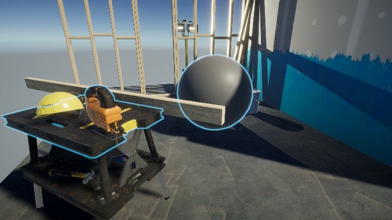
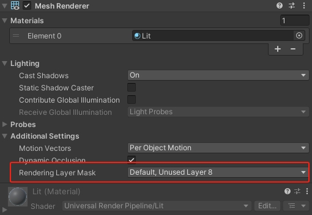

# URP-Screen-Space-Outline
### Screenshots

### Features

- Outline with runtime-changeable color and width
- Outlines are always shown on the top of the image
- Filtered on MeshRenderer's RenderingLayerMask
- Support both opaque and transparent objects

### Usage

- Add RenderFeature
  - To draw outlines for wanted objects, you should choose the LayerMask and RenderingLayerMask
- Add Volume Component
  - This is where you configure outline width and color
- Check RenderingLayerMask

